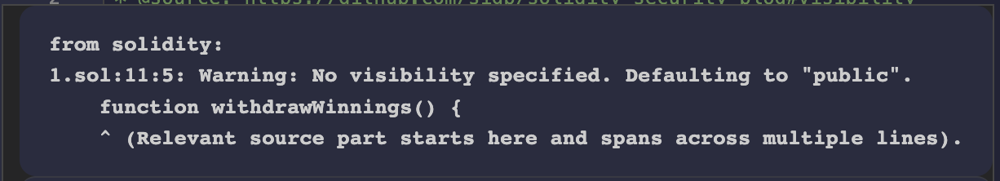

## 标题
函数默认可见性

## 关系
[CWE-710：不正确遵守编码标准](https://cwe.mitre.org/data/definitions/710.html)

## 描述
未指定函数可见性类型的函数默认为public。如果开发人员忘记设置可见性，并且恶意用户能够进行未经授权或意外的状态更改，这可能导致漏洞。

## 修复措施
函数可以被指定为external、public、internal或private。建议对函数选择适当的可见性类型做出有意识的决策。这可以大大减少合约系统的攻击面。

## 参考资料
* [以太坊智能合约最佳实践-可见性](https://consensys.github.io/smart-contract-best-practices/development-recommendations/solidity-specific/visibility/)
* [SigmaPrime-可见性](https://github.com/sigp/solidity-security-blog#visibility)
## 示例
### visibility_not_set.sol
``` solidity
/*
 * @source: https://github.com/sigp/solidity-security-blog#visibility
 * @author: SigmaPrime 
 * Modified by Gerhard Wagner
 */

pragma solidity ^0.4.24;

contract HashForEther {

    function withdrawWinnings() {
        // 如果地址的最后8个十六进制字符为0，则为赢家。
        require(uint32(msg.sender) == 0);
        _sendWinnings();
     }

     function _sendWinnings() {
         msg.sender.transfer(this.balance);
     }
}
```
### visibility_not_set_fixed.sol
``` solidity
/*
 * @source: https://github.com/sigp/solidity-security-blog#visibility
 * @author: SigmaPrime
 * Modified by Gerhard Wagner
 */

pragma solidity ^0.4.24;

contract HashForEther {

    function withdrawWinnings() public {
        // 如果地址的最后8个十六进制字符为0，则为赢家。
        require(uint32(msg.sender) == 0);
        _sendWinnings();
     }

     function _sendWinnings() internal{
         msg.sender.transfer(this.balance);
     }
}
```
## 验证
未指定函数可见性类型的函数会出现warning警告。
