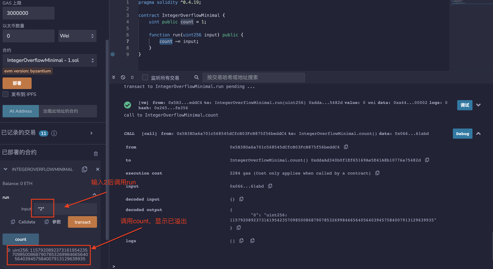

## 标题
整数溢出和下溢

## 关系
[CWE-682：不正确的计算](https://cwe.mitre.org/data/definitions/682.html)

## 描述
当算术运算达到类型的最大或最小时，会发生溢出/下溢。例如，如果一个数字存储在uint8类型中，意味着该数字存储在一个从0到2^8-1的8位无符号数字中。在计算机编程中，当算术运算试图创建一个超出给定位数表示范围的数值（要么大于最大值，要么小于最小可表示值）时，就会发生整数溢出。

## 修复措施
建议在智能合约系统中始终使用经过验证的安全数学库进行算术运算。

## 参考资料
* [以太坊智能合约最佳实践-不安全的算术](https://consensys.github.io/smart-contract-best-practices/attacks/insecure-arithmetic/)
## 示例

### tokensalechallenge.sol
``` solidity
/*
 * @来源: https://capturetheether.com/challenges/math/token-sale/
 * @作者: Steve Marx
 */

pragma solidity ^0.4.21;

contract TokenSaleChallenge {
    mapping(address => uint256) public balanceOf;
    uint256 constant PRICE_PER_TOKEN = 1 ether;

    function TokenSaleChallenge(address _player) public payable {
        require(msg.value == 1 ether);
    }

    function isComplete() public view returns (bool) {
        return address(this).balance < 1 ether;
    }

    function buy(uint256 numTokens) public payable {
        require(msg.value == numTokens * PRICE_PER_TOKEN);

        balanceOf[msg.sender] += numTokens;
    }

    function sell(uint256 numTokens) public {
        require(balanceOf[msg.sender] >= numTokens);

        balanceOf[msg.sender] -= numTokens;
        msg.sender.transfer(numTokens * PRICE_PER_TOKEN);
    }
}
```

### integer_overflow_mapping_sym_1.sol
``` solidity
//单笔交易溢出

pragma solidity ^0.4.11;

contract IntegerOverflowMappingSym1 {
    mapping(uint256 => uint256) map;

    function init(uint256 k, uint256 v) public {
        map[k] -= v;
    }
}

```

### integer_overflow_mapping_sym_1_fixed.sol
``` solidity
//单笔交易溢出
//安全版本

pragma solidity ^0.4.16;

contract IntegerOverflowMappingSym1 {
    mapping(uint256 => uint256) map;

    function init(uint256 k, uint256 v) public {
        map[k] = sub(map[k], v);
    }

    //来自SafeMath
    function sub(uint256 a, uint256 b) internal pure returns (uint256) {
        require(b <= a);//SafeMath在这里使用assert
        return a - b;
    }
}
```

###  integer_overflow_minimal.sol
``` solidity
//单笔交易溢出
//事务后效果：溢出转移到公开可读存储

pragma solidity ^0.4.19;

contract IntegerOverflowMinimal {
    uint public count = 1;

    function run(uint256 input) public {
        count -= input;
    }
}
```

### integer_overflow_minimal_fixed.sol
``` solidity
//单笔交易溢出
//交易后效果：溢出逃逸到公开可读存储
//安全版本

pragma solidity ^0.4.19;

contract IntegerOverflowMinimal {
    uint public count = 1;

    function run(uint256 input) public {
        count = sub(count,input);
    }

    //来自SafeMath
    function sub(uint256 a, uint256 b) internal pure returns (uint256) {
        require(b <= a);//SafeMath在这里使用assert
        return a - b;
    }
}
```

### integer_overflow_mul.sol

``` solidity
//单笔交易溢出
//交易后效果：溢出逃逸到公开可读存储

pragma solidity ^0.4.19;

contract IntegerOverflowMul {
    uint public count = 2;

    function run(uint256 input) public {
        count *= input;
    }
}
```

### integer_overflow_mul_fixed.sol
``` solidity
//单笔交易溢出
//事务后效果：溢出泄漏到可公开读取的存储器中
//安全版本

pragma solidity ^0.4.19;

contract IntegerOverflowMul {
    uint public count = 2;

    function run(uint256 input) public {
        count = mul(count, input);
    }

    //来自SafeMath
    function mul(uint256 a, uint256 b) internal pure returns (uint256) {
      // 燃气优化：这比要求'a'不为零要便宜，但如果'b'也被测试，则会丧失这种好处。
      // 参见：https://github.com/OpenZeppelin/openzeppelin-solidity/pull/522
      if (a == 0) {
        return 0;
      }

      uint256 c = a * b;
      require(c / a == b);

      return c;
    }
}
```

### integer_overflow_multitx_multifunc_feasible.sol
``` solidity
/*
 * @来源: https://github.com/ConsenSys/evm-analyzer-benchmark-suite
 * @作者: Suhabe Bugrara
 */

//多事务，多函数
//可达算术指令

pragma solidity ^0.4.23;

contract IntegerOverflowMultiTxMultiFuncFeasible {
    uint256 private initialized = 0;
    uint256 public count = 1;

    function init() public {
        initialized = 1;
    }

    function run(uint256 input) {
        if (initialized == 0) {
            return;
        }

        count -= input;
    }
}

```

### integer_overflow_multitx_multifunc_feasible_fixed.sol
``` solidity
/*
 * @来源: https://github.com/ConsenSys/evm-analyzer-benchmark-suite
 * @作者: Suhabe Bugrara
 */

//多事务，多函数
//可达算术指令（安全）

pragma solidity ^0.4.23;

contract IntegerOverflowMultiTxMultiFuncFeasible {
    uint256 private initialized = 0;
    uint256 public count = 1;

    function init() public {
        initialized = 1;
    }

    function run(uint256 input) {
        if (initialized == 0) {
            return;
        }

        count = sub(count, input);
    }

    //来自SafeMath
    function sub(uint256 a, uint256 b) internal pure returns (uint256) {
        require(b <= a);//SafeMath在此处使用assert
        return a - b;
    }
}
```

### integer_overflow_multitx_onefunc_feasible.sol
``` solidity
/*
 * @来源: https://github.com/ConsenSys/evm-analyzer-benchmark-suite
 * @作者: Suhabe Bugrara
 */

//多事务，多函数
//可达算术指令（安全）
pragma solidity ^0.4.23;

contract IntegerOverflowMultiTxOneFuncFeasible {
    uint256 private initialized = 0;
    uint256 public count = 1;

    function run(uint256 input) public {
        if (initialized == 0) {
            initialized = 1;
            return;
        }

        count -= input;
    }
}
```

### integer_overflow_multitx_onefunc_feasible_fixed.sol
``` solidity
/*
 * @来源: https://github.com/ConsenSys/evm-analyzer-benchmark-suite
 * @作者: Suhabe Bugrara
 */

//多事务，单函数
//可达算术指令（安全）

pragma solidity ^0.4.23;

contract IntegerOverflowMultiTxOneFuncFeasible {

    uint256 private initialized = 0;
    uint256 public count = 1;

    function run(uint256 input) public {
        if (initialized == 0) {
            initialized = 1;
            return;
        }

        count = sub(count, input);
    }

    //来自SafeMath
    function sub(uint256 a, uint256 b) internal pure returns (uint256) {
        require(b <= a);//SafeMath在这里使用assert
        return a - b;
    }
}
```

### integer_overflow_multitx_onefunc_infeasible.sol
``` solidity
/*
 * @来源: https://github.com/ConsenSys/evm-analyzer-benchmark-suite
 * @作者: Suhabe Bugrara
 */
//多事务，单函数
//溢出不可行因为算术指令不可达

pragma solidity ^0.4.23;

contract IntegerOverflowMultiTxOneFuncInfeasible {
    uint256 private initialized = 0;
    uint256 public count = 1;

    function run(uint256 input) public {
        if (initialized == 0) {
            return;
        }

        count -= input;
    }
}
```

### overflow_simple_add.sol
``` solidity
pragma solidity 0.4.24;

contract Overflow_Add {
    uint public balance = 1;

    function add(uint256 deposit) public {
        balance += deposit;
    }
}
```

### overflow_simple_add_fixed.sol

``` solidity
pragma solidity ^0.4.24;

contract Overflow_Add {
    uint public balance = 1;

    function add(uint256 deposit) public {
        balance = add(balance, deposit);
    }

    //from SafeMath
    function add(uint256 a, uint256 b) internal pure returns (uint256) {
      uint256 c = a + b;
      require(c >= a);

      return c;
    }
}

```
### BECToken.sol
``` solidity
pragma solidity ^0.4.16;

/**
 * @标题 SafeMath
 * @@dev 在错误发生时会抛出异常的安全检查的数学操作
 */
library SafeMath {
  function mul(uint256 a, uint256 b) internal constant returns (uint256) {
    uint256 c = a * b;
    require(a == 0 || c / a == b);
    return c;
  }

  function div(uint256 a, uint256 b) internal constant returns (uint256) {
    // 要求(b > 0); // 在Solidity中，当除以0时会自动抛出异常
    uint256 c = a / b;
    // 要求(a == b * c + a % b); // 在任何情况下，这个等式都成立
    return c;
  }

  function sub(uint256 a, uint256 b) internal constant returns (uint256) {
    require(b <= a);
    return a - b;
  }

  function add(uint256 a, uint256 b) internal constant returns (uint256) {
    uint256 c = a + b;
    require(c >= a);
    return c;
  }
}

/**
 * @标题 ERC20Basic
 * @ERC20接口的简化版本
 * @dev see https://github.com/ethereum/EIPs/issues/179
 */
contract ERC20Basic {
  uint256 public totalSupply;
  function balanceOf(address who) public constant returns (uint256);
  function transfer(address to, uint256 value) public returns (bool);
  event Transfer(address indexed from, address indexed to, uint256 value);
}

/**
 * @标题 Basic token
 * @标准令牌（StandardToken）的基本版本，没有授权功能。
 */
contract BasicToken is ERC20Basic {
  using SafeMath for uint256;

  mapping(address => uint256) balances;

  /**
  * @翻译：将开发者代币转移到指定地址。
  * @param _to 要转移到的地址。
  * @param _value 要转移的数量。
  */
  function transfer(address _to, uint256 _value) public returns (bool) {
    require(_to != address(0));
    require(_value > 0 && _value <= balances[msg.sender]);

    // 如果余额不足，SafeMath.sub将会抛出异常。
    balances[msg.sender] = balances[msg.sender].sub(_value);
    balances[_to] = balances[_to].add(_value);
    Transfer(msg.sender, _to, _value);
    return true;
  }

  /**
  * @获取指定地址的余额。
  * @param _owner 要查询余额的地址。
  * @return 一个表示该地址拥有的金额的 uint256。
  */
  function balanceOf(address _owner) public constant returns (uint256 balance) {
    return balances[_owner];
  }
}

/**
 * @标题 ERC20 interface
 * @dev see https://github.com/ethereum/EIPs/issues/20
 */
contract ERC20 is ERC20Basic {
  function allowance(address owner, address spender) public constant returns (uint256);
  function transferFrom(address from, address to, uint256 value) public returns (bool);
  function approve(address spender, uint256 value) public returns (bool);
  event Approval(address indexed owner, address indexed spender, uint256 value);
}


/**
 * @标题 Standard ERC20 token
 *
 * @dev 基本标准令牌的实现。
 * @dev https://github.com/ethereum/EIPs/issues/20
 * @dev Based on code by FirstBlood: https://github.com/Firstbloodio/token/blob/master/smart_contract/FirstBloodToken.sol
 */
contract StandardToken is ERC20, BasicToken {

  mapping (address => mapping (address => uint256)) internal allowed;


  /**
   * @从一个地址向另一个地址转移代币
   * @param _from 地址 要发送代币的地址
   * @param _to 地址 要转移到的地址
   * @param _value uint256 要转移的代币数量
   */
  function transferFrom(address _from, address _to, uint256 _value) public returns (bool) {
    require(_to != address(0));
    require(_value > 0 && _value <= balances[_from]);
    require(_value <= allowed[_from][msg.sender]);

    balances[_from] = balances[_from].sub(_value);
    balances[_to] = balances[_to].add(_value);
    allowed[_from][msg.sender] = allowed[_from][msg.sender].sub(_value);
    Transfer(_from, _to, _value);
    return true;
  }

  /**
   * @批准传递的地址代表msg.sender花费指定数量的代币。
   * 请注意，使用此方法更改津贴存在一个风险，即某人可能通过不幸的交易顺序同时使用旧津贴和新津贴。解决这个竞争条件的一个可能的解决方案是首先将支出者的津贴减少到0，然后再设置所需的值：
   https://github.com/ethereum/EIPs/issues/20#issuecomment-263524729
   * @param _spender 将花费资金的地址。
   * @param _value 要花费的代币数量。
   */
  function approve(address _spender, uint256 _value) public returns (bool) {
    allowed[msg.sender][_spender] = _value;
    Approval(msg.sender, _spender, _value);
    return true;
  }

  /**
   * @检查拥有者允许给花费者的代币数量的函数。
   * @param _owner 地址拥有资金的地址。
   * @param _spender 将花费资金的地址。
   * @return 一个 uint256 指定花费者仍然可用的代币数量。
   */
  function allowance(address _owner, address _spender) public constant returns (uint256 remaining) {
    return allowed[_owner][_spender];
  }
}

/**
 * @标题 Ownable
 * @Ownable合约具有一个所有者地址，并提供基本的授权控制函数，这简化了“用户权限”的实现。
 */
contract Ownable {
  address public owner;


  event OwnershipTransferred(address indexed previousOwner, address indexed newOwner);


  /**
   * @Ownable构造函数将合约的原始所有者设置为发送方账户。
   */
  function Ownable() {
    owner = msg.sender;
  }


  /**
   * @如果由非所有者账户调用，则会抛出异常。
   */
  modifier onlyOwner() {
    require(msg.sender == owner);
    _;
  }


  /**
   * @允许当前所有者将合约的控制权转移给新的所有者。
   * @param newOwner 要转移所有权的地址。
   */
  function transferOwnership(address newOwner) onlyOwner public {
    require(newOwner != address(0));
    OwnershipTransferred(owner, newOwner);
    owner = newOwner;
  }

}

/**
 * @标题 Pausable
 * @基于合约的开发，允许子合约实现紧急停止机制。
 */
contract Pausable is Ownable {
  event Pause();
  event Unpause();

  bool public paused = false;


  /**
   * @将 dev 修改器转化为仅在合约暂停时不可调用的函数。
   */
  modifier whenNotPaused() {
    require(!paused);
    _;
  }

  /**
   * @将修改器转换为仅在合约暂停时可调用的函数。
   */
  modifier whenPaused() {
    require(paused);
    _;
  }

  /**
   * @开发者被所有者叫停，触发了停止状态。
   */
  function pause() onlyOwner whenNotPaused public {
    paused = true;
    Pause();
  }

  /**
   * @被所有者召唤解除暂停的开发者，恢复正常状态。
   */
  function unpause() onlyOwner whenPaused public {
    paused = false;
    Unpause();
  }
}

/**
 * @标题 Pausable token
 *
 * @带有可暂停转账功能的标准令牌（StandardToken）进行了修改。
 **/

contract PausableToken is StandardToken, Pausable {

  function transfer(address _to, uint256 _value) public whenNotPaused returns (bool) {
    return super.transfer(_to, _value);
  }

  function transferFrom(address _from, address _to, uint256 _value) public whenNotPaused returns (bool) {
    return super.transferFrom(_from, _to, _value);
  }

  function approve(address _spender, uint256 _value) public whenNotPaused returns (bool) {
    return super.approve(_spender, _value);
  }

  function batchTransfer(address[] _receivers, uint256 _value) public whenNotPaused returns (bool) {
    uint cnt = _receivers.length;
    uint256 amount = uint256(cnt) * _value;
    require(cnt > 0 && cnt <= 20);
    require(_value > 0 && balances[msg.sender] >= amount);

    balances[msg.sender] = balances[msg.sender].sub(amount);
    for (uint i = 0; i < cnt; i++) {
        balances[_receivers[i]] = balances[_receivers[i]].add(_value);
        Transfer(msg.sender, _receivers[i], _value);
    }
    return true;
  }
}

/**
 * @标题 Bec Token
 *
 * @基于基本标准令牌的Bec Token的dev实现。
 */
contract BecToken is PausableToken {
    /**
    * 令牌的公共变量
    * 以下变量是可选的额外信息，不一定需要包含在其中。
    * 它们允许自定义令牌合约，但不会影响核心功能。
    * 一些钱包/接口可能甚至不会关注这些信息。
    */
    string public name = "BeautyChain";
    string public symbol = "BEC";
    string public version = '1.0.0';
    uint8 public decimals = 18;

    /**
     * @检查拥有者允许给支出者的代币数量的函数。
     */
    function BecToken() {
      totalSupply = 7000000000 * (10**(uint256(decimals)));
      balances[msg.sender] = totalSupply;    // Give the creator all initial tokens
    }

    function () {
        //如果以太被发送到这个地址，请将其退还。
        revert();
    }
}
```

## 验证
部署 integer_overflow_minimal.sol之内的合约，调用run函数输入2，count显示溢出。
