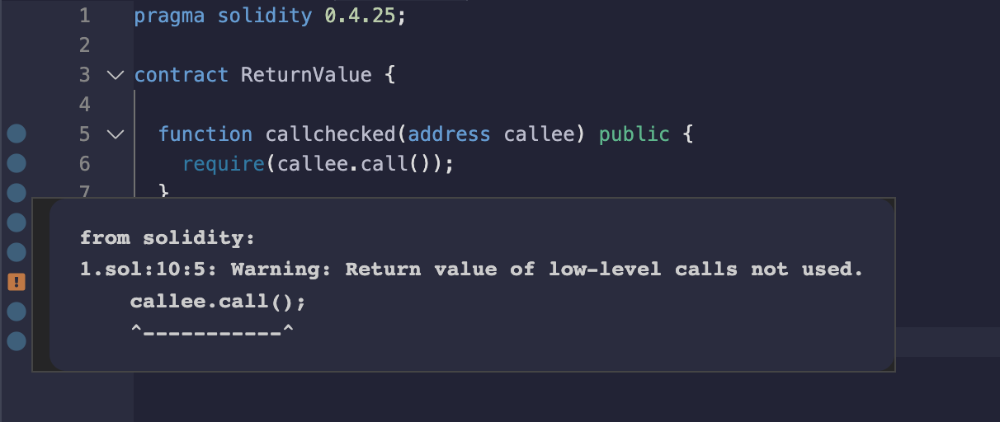

## 标题
未经检查的调用返回值

## 关系
[CWE-252：未经检查的返回值](https://cwe.mitre.org/data/definitions/252.html)

## 描述
未检查消息调用的返回值。即使被调用的合约抛出异常，执行也会继续进行。如果调用意外失败或攻击者强制调用失败，可能会导致后续程序逻辑出现意外行为。

## 修复措施
如果选择使用低级别的调用方法，请确保通过检查返回值来处理调用可能失败的情况。

## 参考资料
* [以太坊智能合约最佳实践-处理外部调用中的错误](https://consensys.github.io/smart-contract-best-practices/development-recommendations/general/external-calls/#handle-errors-in-external-calls)
## 示例

### unchecked_return_value.sol
``` solidity
pragma solidity 0.4.25;

contract ReturnValue {

  function callchecked(address callee) public {
    require(callee.call());
  }

  function callnotchecked(address callee) public {
    callee.call();
  }
}

```
## 验证
使用低级别的调用方法，未通过检查返回值来处理调用会出现未使用警告。
