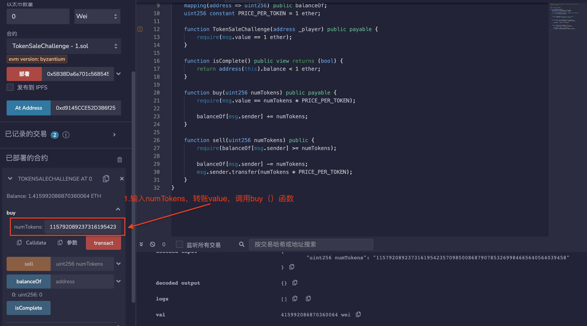
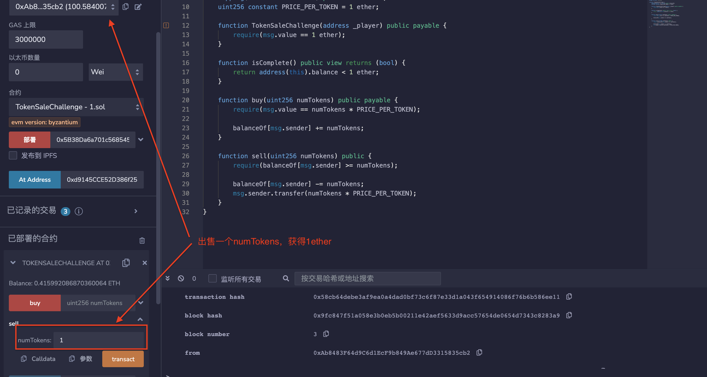

## 标题
未保护的Ether提取

## 关系
[CWE-284：不正确的访问控制](https://cwe.mitre.org/data/definitions/284.html)

## 描述
由于缺少或不足的访问控制，恶意方可以从合约账户提取一些或全部以太。

这个漏洞有时是由于无意中暴露了初始化函数引起的。通过错误地命名一个本应作为构造函数的函数，构造函数的代码最终出现在运行时的字节码中，任何人都可以调用它来重新初始化合约。

## 修复措施
实现控制，使得只有经过授权方可以触发提款，或根据智能合约系统的规范进行。

## 参考资料
* [Rubixi智能合约](https://etherscan.io/address/0xe82719202e5965Cf5D9B6673B7503a3b92DE20be#code)

## 示例

### tokensalechallenge.sol
``` solidity
/*
 * @来源: https://capturetheether.com/challenges/math/token-sale/
 * @作者: Steve Marx
 */

pragma solidity ^0.4.21;

contract TokenSaleChallenge {
    mapping(address => uint256) public balanceOf;
    uint256 constant PRICE_PER_TOKEN = 1 ether;

    function TokenSaleChallenge(address _player) public payable {
        require(msg.value == 1 ether);
    }

    function isComplete() public view returns (bool) {
        return address(this).balance < 1 ether;
    }

    function buy(uint256 numTokens) public payable {
        require(msg.value == numTokens * PRICE_PER_TOKEN);

        balanceOf[msg.sender] += numTokens;
    }

    function sell(uint256 numTokens) public {
        require(balanceOf[msg.sender] >= numTokens);

        balanceOf[msg.sender] -= numTokens;
        msg.sender.transfer(numTokens * PRICE_PER_TOKEN);
    }
}

```

### rubixi.sol
``` solidity
pragma solidity ^0.4.22;

contract Rubixi {

        //为合约声明存储关键变量
        uint private balance = 0;
        uint private collectedFees = 0;
        uint private feePercent = 10;
        uint private pyramidMultiplier = 300;
        uint private payoutOrder = 0;

        address private creator;

        //设置创建者
        function DynamicPyramid() {
                creator = msg.sender;
        }

        modifier onlyowner {
                if (msg.sender == creator) _;
        }

        struct Participant {
                address etherAddress;
                uint payout;
        }

        Participant[] private participants;

        //回退函数
        function() {
                init();
        }

        //init函数在回退中运行
        function init() private {
                //确保只有价值为1以太或更高的交易被处理并添加到金字塔中。
                if (msg.value < 1 ether) {
                        collectedFees += msg.value;
                        return;
                }

                uint _fee = feePercent;
                //任何以太价值大于50的交易将获得50%的手续费返还。
                if (msg.value >= 50 ether) _fee /= 2;

                addPayout(_fee);
        }

        //要求对合约进行有效交易的函数
        function addPayout(uint _fee) private {
                //向参与者数组添加新地址
                participants.push(Participant(msg.sender, (msg.value * pyramidMultiplier) / 100));

                //这些声明确保了对后来的金字塔参与者更快的支付系统，从而使金字塔计划的寿命更长。
                if (participants.length == 10) pyramidMultiplier = 200;
                else if (participants.length == 25) pyramidMultiplier = 150;

                // 收取费用并更新合同余额
                balance += (msg.value * (100 - _fee)) / 100;
                collectedFees += (msg.value * _fee) / 100;

                //如果余额足够，提前支付早期参与者。
                while (balance > participants[payoutOrder].payout) {
                        uint payoutToSend = participants[payoutOrder].payout;
                        participants[payoutOrder].etherAddress.send(payoutToSend);

                        balance -= participants[payoutOrder].payout;
                        payoutOrder += 1;
                }
        }

        //创作者的费用功能
        function collectAllFees() onlyowner {
                if (collectedFees == 0) throw;

                creator.send(collectedFees);
                collectedFees = 0;
        }

        function collectFeesInEther(uint _amt) onlyowner {
                _amt *= 1 ether;
                if (_amt > collectedFees) collectAllFees();

                if (collectedFees == 0) throw;

                creator.send(_amt);
                collectedFees -= _amt;
        }

        function collectPercentOfFees(uint _pcent) onlyowner {
                if (collectedFees == 0 || _pcent > 100) throw;

                uint feesToCollect = collectedFees / 100 * _pcent;
                creator.send(feesToCollect);
                collectedFees -= feesToCollect;
        }

        //更改与合同相关的变量的功能
        function changeOwner(address _owner) onlyowner {
                creator = _owner;
        }

        function changeMultiplier(uint _mult) onlyowner {
                if (_mult > 300 || _mult < 120) throw;

                pyramidMultiplier = _mult;
        }

        function changeFeePercentage(uint _fee) onlyowner {
                if (_fee > 10) throw;

                feePercent = _fee;
        }

        //通过JSON接口或其他接口向最终用户提供信息的功能
        function currentMultiplier() constant returns(uint multiplier, string info) {
                multiplier = pyramidMultiplier;
                info = 'This multiplier applies to you as soon as transaction is received, may be lowered to hasten payouts or increased if payouts are fast enough. Due to no float or decimals, multiplier is x100 for a fractional multiplier e.g. 250 is actually a 2.5x multiplier. Capped at 3x max and 1.2x min.';
        }

        function currentFeePercentage() constant returns(uint fee, string info) {
                fee = feePercent;
                info = 'Shown in % form. Fee is halved(50%) for amounts equal or greater than 50 ethers. (Fee may change, but is capped to a maximum of 10%)';
        }

        function currentPyramidBalanceApproximately() constant returns(uint pyramidBalance, string info) {
                pyramidBalance = balance / 1 ether;
                info = 'All balance values are measured in Ethers, note that due to no decimal placing, these values show up as integers only, within the contract itself you will get the exact decimal value you are supposed to';
        }

        function nextPayoutWhenPyramidBalanceTotalsApproximately() constant returns(uint balancePayout) {
                balancePayout = participants[payoutOrder].payout / 1 ether;
        }

        function feesSeperateFromBalanceApproximately() constant returns(uint fees) {
                fees = collectedFees / 1 ether;
        }

        function totalParticipants() constant returns(uint count) {
                count = participants.length;
        }

        function numberOfParticipantsWaitingForPayout() constant returns(uint count) {
                count = participants.length - payoutOrder;
        }

        function participantDetails(uint orderInPyramid) constant returns(address Address, uint Payout) {
                if (orderInPyramid <= participants.length) {
                        Address = participants[orderInPyramid].etherAddress;
                        Payout = participants[orderInPyramid].payout / 1 ether;
                }
        }
}
```

### multiowned_not_vulnerable.sol
``` solidity
pragma solidity ^0.4.23;

/**
 * @多个所有者
 */
contract MultiOwnable {
  address public root;
  mapping (address => address) public owners; // owner => parent of owner

  /**
  * @Ownable构造函数将合约的原始“owner”设置为发送者的帐户。
  */
  constructor() public {
    root = msg.sender;
    owners[root] = root;
  }

  /**
  * @如果由非所有者账户调用，则会引发异常。
  */
  modifier onlyOwner() {
    require(owners[msg.sender] != 0);
    _;
  }

  /**
  * @添加新的所有者
  * 注意这里使用了"onlyOwner"修饰符。
  */ 
  function newOwner(address _owner) onlyOwner external returns (bool) {
    require(_owner != 0);
    owners[_owner] = msg.sender;
    return true;
  }

  /**
    * @删除所有者
    */
  function deleteOwner(address _owner) onlyOwner external returns (bool) {
    require(owners[_owner] == msg.sender || (owners[_owner] != 0 && msg.sender == root));
    owners[_owner] = 0;
    return true;
  }
}

contract TestContract is MultiOwnable {

  function withdrawAll() onlyOwner {
    msg.sender.transfer(this.balance);
  }

  function() payable {
  }

}
```

### multiowned_vulnerable.sol
``` solidity
pragma solidity ^0.4.23;

/**
 * @多个所有者
 */
contract MultiOwnable {
  address public root;
  mapping (address => address) public owners; // owner => parent of owner

  /**
  * @Ownable构造函数将合约的原始“owner”设置为发送者的帐户。
  */
  constructor() public {
    root = msg.sender;
    owners[root] = root;
  }

  /**
  * @如果由非所有者账户调用，则会引发异常。
  */
  modifier onlyOwner() {
    require(owners[msg.sender] != 0);
    _;
  }

  /**
  * @添加新的所有者
  * 请注意，这里缺少“onlyOwner”修饰符。
  */ 
  function newOwner(address _owner) external returns (bool) {
    require(_owner != 0);
    owners[_owner] = msg.sender;
    return true;
  }

  /**
    * @删除所有者
    */
  function deleteOwner(address _owner) onlyOwner external returns (bool) {
    require(owners[_owner] == msg.sender || (owners[_owner] != 0 && msg.sender == root));
    owners[_owner] = 0;
    return true;
  }
}

contract TestContract is MultiOwnable {

  function withdrawAll() onlyOwner {
    msg.sender.transfer(this.balance);
  }

  function() payable {
  }

}
```

### simple_ether_drain.sol
``` solidity
pragma solidity ^0.4.22;

contract SimpleEtherDrain {

  function withdrawAllAnyone() {
    msg.sender.transfer(this.balance);
  }

  function () public payable {
  }

}
```

### wallet_01_ok.sol
``` solidity
pragma solidity ^0.4.24;

/* 用户可以添加和提取以太。
   没有人可以提取比他们添加的以太更多的金额。
*/

contract Wallet {
    address creator;

    mapping(address => uint256) balances;

    constructor() public {
        creator = msg.sender;
    }

    function deposit() public payable {
        assert(balances[msg.sender] + msg.value > balances[msg.sender]);
        balances[msg.sender] += msg.value;
    }

    function withdraw(uint256 amount) public {
        require(amount <= balances[msg.sender]);
        msg.sender.transfer(amount);
        balances[msg.sender] -= amount;
    }

    function refund() public {
        msg.sender.transfer(balances[msg.sender]);
        balances[msg.sender] = 0;
    }

    // 在紧急情况下，所有者可以将所有资金迁移到不同的地址。

    function migrateTo(address to) public {
        require(creator == msg.sender);
        to.transfer(this.balance);
    }

}
```

### wallet_02_refund_nosub.sol
``` solidity
pragma solidity ^0.4.24;

/* 用户可以添加以太并提取以太。
   不幸的是，开发者在调用refund()时忘记将用户的余额设置为0。
   攻击者可以支付少量的以太，并反复调用refund()来清空合约。
*/

contract Wallet {
    address creator;

    mapping(address => uint256) balances;

    constructor() public {
        creator = msg.sender;
    }

    function deposit() public payable {
        assert(balances[msg.sender] + msg.value > balances[msg.sender]);
        balances[msg.sender] += msg.value;
    }

    function withdraw(uint256 amount) public {
        require(amount <= balances[msg.sender]);
        msg.sender.transfer(amount);
        balances[msg.sender] -= amount;
    }

    function refund() public {
        msg.sender.transfer(balances[msg.sender]);
    }

    // 在紧急情况下，所有者可以将所有资金迁移到不同的地址。

    function migrateTo(address to) public {
        require(creator == msg.sender);
        to.transfer(this.balance);
    }

}
```

### wallet_03_wrong_constructor.sol
``` solidity
pragma solidity ^0.4.24;

/* 用户可以添加以太并提取。
   构造函数命名错误，因此任何人都可以成为“创建者”并提取所有资金。
*/

contract Wallet {
    address creator;

    mapping(address => uint256) balances;

    function initWallet() public {
        creator = msg.sender;
    }

    function deposit() public payable {
        assert(balances[msg.sender] + msg.value > balances[msg.sender]);
        balances[msg.sender] += msg.value;
    }

    function withdraw(uint256 amount) public {
        require(amount <= balances[msg.sender]);
        msg.sender.transfer(amount);
        balances[msg.sender] -= amount;
    }

    // 在紧急情况下，所有者可以将所有资金迁移到不同的地址。

    function migrateTo(address to) public {
        require(creator == msg.sender);
        to.transfer(this.balance);
    }

}
```

### wallet_04_confused_sign.sol
``` solidity
pragma solidity ^0.4.24;

/* 用户可以添加付款和提取以太。
   不幸的是，开发者在“withdraw（）”中使用了错误的比较运算符。
   任何人都可以提取任意数量的以太 :()
*/

contract Wallet {
    address creator;

    mapping(address => uint256) balances;

    constructor() public {
        creator = msg.sender;
    }

    function deposit() public payable {
        assert(balances[msg.sender] + msg.value > balances[msg.sender]);
        balances[msg.sender] += msg.value;
    }

    function withdraw(uint256 amount) public {
        require(amount >= balances[msg.sender]);
        msg.sender.transfer(amount);
        balances[msg.sender] -= amount;
    }

    //在紧急情况下，所有者可以将所有资金迁移到不同的地址。

    function migrateTo(address to) public {
        require(creator == msg.sender);
        to.transfer(this.balance);
    }

}
```

## 验证
在remix测试机转账1ether部署tokensalechallenge.sol中合约，在buy方法上，可能存在上溢。因为虽然合约里eth的单位是ether，但是他的存储还是以wei为单位。1 ether=10^18.如果我们传入一个较大的numTokens，产生溢出得到一个很小的value。
* 调用buy（）函数输入下方numTokens值以及转账下方valve的值
``` solidity
 numTokens=2**256/10**18 +1 = 115792089237316195423570985008687907853269984665640564039458
 value=numTokens*10**18%2**256 = 415992086870360064
```

* 调用sell（）函数出售一个numTokens，获得1个ether。

