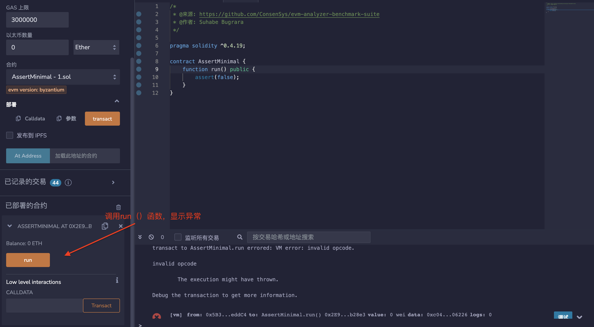
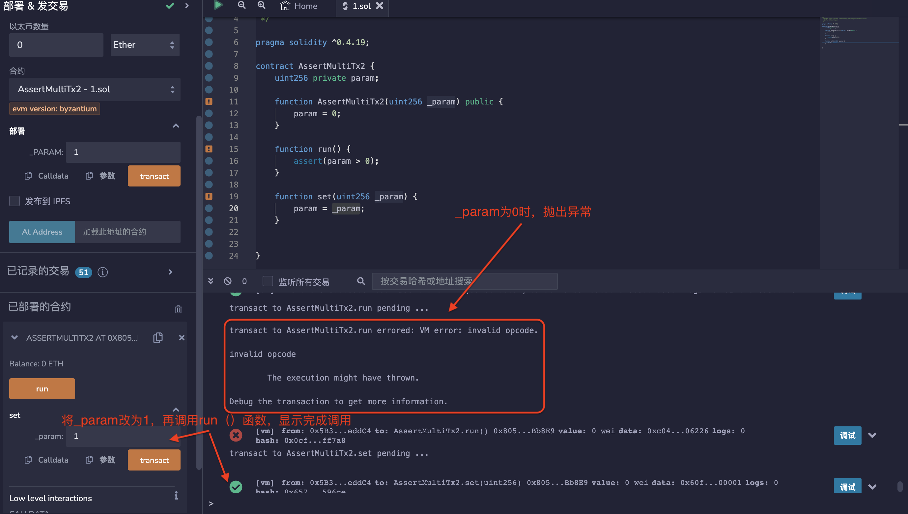

## 标题
断言违规

## 关系
[CWE-670：始终不正确的控制流程实现](https://cwe.mitre.org/data/definitions/670.html)

## 描述
Solidity中的assert()函数用于断言不变量。正常运行的代码不应该触发失败的assert语句。可触发的断言可能意味着以下两种情况之一：
1. 合约存在错误，使其进入无效状态；
2. assert语句的使用不正确，例如用于验证输入。

## 修复措施
请考虑在assert()中检查的条件是否实际上是一个不变量。如果不是，请用require()语句替换assert()语句。
如果异常确实是由代码的意外行为引起的，请修复允许违反断言的潜在错误。

## 参考资料
* [在Solidity中使用revert()、assert()和require()，以及EVM中的新REVERT操作码](https://media.consensys.net/when-to-use-revert-assert-and-require-in-solidity-61fb2c0e5a57)

## 示例

### assert_constructor.sol
``` solidity
/*
 * @来源: https://github.com/ConsenSys/evm-analyzer-benchmark-suite
 * @作者: Suhabe Bugrara
 */

pragma solidity ^0.4.19;

contract AssertConstructor {
    function AssertConstructor() public {
        assert(false);
    }
}
```

### assert_minimal.sol
``` solidity
/*
 * @来源: https://github.com/ConsenSys/evm-analyzer-benchmark-suite
 * @作者: Suhabe Bugrara
 */

pragma solidity ^0.4.19;

contract AssertMinimal {
    function run() public {
        assert(false);
    }
}
```

### assert_multitx_1.sol
``` solidity
/*
 * @来源: https://github.com/ConsenSys/evm-analyzer-benchmark-suite
 * @作者: Suhabe Bugrara
 */

pragma solidity ^0.4.19;

contract AssertMultiTx1 {
    uint256 private param;

    function AssertMultiTx1(uint256 _param) public {
        require(_param > 0);
        param = _param;
    }

    function run() {
        assert(param > 0);
    }

}
```

### assert_multitx_2.sol
``` solidity
/*
 * @来源: https://github.com/ConsenSys/evm-analyzer-benchmark-suite
 * @作者: Suhabe Bugrara
 */

pragma solidity ^0.4.19;

contract AssertMultiTx2 {
    uint256 private param;

    function AssertMultiTx2(uint256 _param) public {
        param = 0;
    }

    function run() {
        assert(param > 0);
    }

    function set(uint256 _param) {
        param = _param;
    }


}
```

### constructor_create.sol
``` solidity
/*
 * @来源: ChainSecurity
 * @作者: Anton Permenev
 */

pragma solidity ^0.4.25;

contract ConstructorCreate{
    B b = new B();

    function check(){
        assert(b.foo() == 10);
    }

}

contract B{

    function foo() returns(uint){
        return 11;
    }
}
```

### constructor_create_argument.sol
``` solidity
/*
 * @来源: ChainSecurity
 * @作者: Anton Permenev
 */
pragma solidity ^0.4.22;

contract ConstructorCreateArgument{
    B b = new B(11);

    function check(){
        assert(b.foo() == 10);
    }

}

contract B{

    uint x_;
    constructor(uint x){
        x_ = x;
    }

    function foo() returns(uint){
        return x_;
    }
}
```

### constructor_create_modifiable.sol
``` solidity
/*
 * @来源：ChainSecurity
 * @作者：Anton Permenev
 * 断言违规，包含2个消息调用：
 * - B.set_x(X): X != 10
 * - ContructorCreateModifiable.check()
 */

pragma solidity ^0.4.22;

contract ContructorCreateModifiable{
    B b = new B(10);

    function check(){
        assert(b.foo() == 10);
    }

}

contract B{

    uint x_;
    constructor(uint x){
        x_ = x;
    }

    function foo() returns(uint){
        return x_;
    }

    function set_x(uint x){
        x_ = x;
    }
}
```

### gas_model.sol
``` solidity
/*
 * @来源: ChainSecurity
 * @作者: Anton Permenev
 */
pragma solidity ^0.4.21;

contract gasModel{
    uint x = 100;
    function check(){
        uint a = gasleft();
        x = x + 1;
        uint b = gasleft();
        assert(b > a);
    }
}
```

### gas_model_fixed.sol
``` solidity
/*
 * @来源: ChainSecurity
 * @作者: Anton Permenev
 */
pragma solidity ^0.4.21;

contract gasModelFixed{
    uint x = 100;
    function check(){
        uint a = gasleft();
        x = x + 1;
        uint b = gasleft();
        assert(b < a);
    }
}
```

### mapping_perfomance_2.sol
``` solidity
/*
 * @来源: ChainSecurity
 * @作者: Anton Permenev
 */
pragma solidity ^0.4.22;

contract MappingPerformance2sets{

    mapping(bytes32=>uint) m0;
    mapping(bytes32=>uint) m1;
    mapping(bytes32=>uint) m2;
    mapping(bytes32=>uint) m3;
    mapping(bytes32=>uint) m4;
    mapping(bytes32=>uint) m5;
    uint b;

    constructor(){
        b = 10;
    }

    function set(bytes32 a, uint cond){
        if(cond == 0){
            m0[a] = 5;
        }else if(cond == 1){
            m1[a] = 5;
        }else if(cond == 2){
            m2[a] = 5;
        }else if(cond == 3){
            m3[a] = 5;
        }else if(cond == 4){
            m4[a] = 5;
        }
    }
    function check(bytes32 a0, uint cond0,
                  bytes32 a1, uint cond1, bytes32 a){
                      set(a0, cond0);
                      set(a1, cond1);
                      assert(m5[a] == 0);
    }
}
```

### mapping_performance_1.sol
``` solidity
/*
 * @来源: ChainSecurity
 * @作者: Anton Permenev
 */
pragma solidity ^0.4.22;

contract MappingPerformance1set{

    mapping(bytes32=>uint) m0;
    mapping(bytes32=>uint) m1;
    mapping(bytes32=>uint) m2;
    mapping(bytes32=>uint) m3;
    mapping(bytes32=>uint) m4;
    mapping(bytes32=>uint) m5;
    uint b;

    constructor(){
        b = 10;
    }

    function set(bytes32 a, uint cond){
        if(cond == 0){
            m0[a] = 5;
        }else if(cond == 1){
            m1[a] = 5;
        }else if(cond == 2){
            m2[a] = 5;
        }else if(cond == 3){
            m3[a] = 5;
        }else if(cond == 4){
            m4[a] = 5;
        }
    }
    function check(bytes32 a0, uint cond0, bytes32 a){
                      set(a0, cond0);
                      assert(m5[a] == 0);
    }
}
```

### out-of-bounds-exception.sol
``` solidity
pragma solidity ^0.5.0;

contract OutOfBoundsException {

    uint256[] private array;

    function getArrayElement(uint256 idx) public returns (uint256) {
        return array[idx];
    }

}
```

### return_memory.sol
``` solidity
/*
 * @来源：https://forum.zeppelin.solutions/t/using-automatic-analysis-tools-with-makerdao-contracts/1021/3
 * 作者：Dan Guido / Trail of Bits
 * 经Bernhard Mueller11111修改

* 可能在3个交易中发生断言违规：
*
* etch(addr)
* lookup(slate, addr)
* checkAnInvariant()

* 其中 slate == Keccak(addr)
*
* 理想情况下，工具应该输出正确的交易跟踪。
*/

pragma solidity ^0.5.0;

contract ReturnMemory {
    mapping(bytes32=>address) public slates;
    bool everMatched = false;

    function etch(address yay) public returns (bytes32 slate) {
        bytes32 hash = keccak256(abi.encodePacked(yay));
        slates[hash] = yay;
        return hash;
    }

    function lookup(bytes32 slate, address nay) public {
       if (nay != address(0x0)) {
         everMatched = slates[slate] == nay;
       }
    }

    function checkAnInvariant() public returns (bool) {
        assert(!everMatched);
    }
}
```

### runtime_create_user_input.sol
``` solidity
/*
 * @来源: ChainSecurity
 * @作者: Anton Permenev
 */
pragma solidity ^0.4.22;

contract RuntimeCreateUserInput{

    function check(uint x){
        B b = new B(x);
        assert(b.foo() == 10);
    }

}

contract B{

    uint x_;
    constructor(uint x){
        x_ = x;
    }

    function foo() returns(uint){
        return x_;
    }

}

```

### runtime_user_input_call.sol
``` solidity
/*
 * @来源: ChainSecurity
 * @作者: Anton Permenev
 */
pragma solidity ^0.4.19;

contract RuntimeUserInputCall{

    function check(address b){
        assert(B(b).foo() == 10);
    }

}

contract B{
    function foo() returns(uint);
}
```

### sha_of_sha_2_mappings.sol
``` solidity
/*
 * @来源: ChainSecurity
 * @作者: Anton Permenev
 */
pragma solidity ^0.4.22;

contract ShaOfSha2Mappings{

    mapping(bytes32=>uint) m;
    mapping(bytes32=>uint) n;

    constructor(){
        m[keccak256(abi.encode("AAA", msg.sender))] = 100;
    }

    function check(address a){
        assert(n[keccak256(abi.encode("BBB", a))] == 0);
    }

}
```

### sha_of_sha_collision.sol
``` solidity
/*
 * @来源: ChainSecurity
 * @作者: Anton Permenev
 * 断言违规，有两个消息调用:
 * - set(66)
 * - check(0x4100000000000000000000000000000000000000000000000000000000000000)
 */
pragma solidity ^0.4.22;

contract ShaOfShaCollission{

    mapping(bytes32=>uint) m;

    function set(uint x){
        m[keccak256(abi.encodePacked("A", x))] = 1;
    }
    function check(uint x){
        assert(m[keccak256(abi.encodePacked(x, "B"))] == 0);
    }

}
```

### sha_of_sha_concrete.sol
``` solidity
/*
 * @来源: ChainSecurity
 * @作者: Anton Permenev
 */
pragma solidity ^0.4.22;

contract ShaOfShaConcrete{

    mapping(bytes32=>uint) m;
    uint b;

    constructor(){
        b = 1;
    }

    function check(uint x){
        assert(m[keccak256(abi.encodePacked(x, "B"))] == 0);
    }

}
```

### token-with-backdoor.sol
``` solidity
/* 
 * @来源: TrailofBits在TruffleCon 2018的研讨会
 * @作者：Josselin Feist（由Bernhard Mueller适应SWC）
 * 三个消息调用的断言违规：
 * - airdrop()
 * - backdoor()
 * - test_invariants()
 */
pragma solidity ^0.4.22;

contract Token{

    mapping(address => uint) public balances;
    function airdrop() public{
        balances[msg.sender] = 1000;
    }

    function consume() public{
        require(balances[msg.sender]>0);
        balances[msg.sender] -= 1;
    }

    function backdoor() public{
        balances[msg.sender] += 1;
    }

   function test_invariants() {
      assert(balances[msg.sender] <= 1000);
  }
}
```

### two_mapppings.sol
``` solidity
pragma solidity ^0.4.22;

contract TwoMappings{

    mapping(uint=>uint) m;
    mapping(uint=>uint) n;

    constructor(){
        m[10] = 100;
    }

    function check(uint a){
        assert(n[a] == 0);
    }

}
```

### simpledschief.sol
``` solidity
/*
 * @来源: https://forum.zeppelin.solutions/t/using-automatic-analysis-tools-with-makerdao-contracts/1021/3
 * 作者: Vera Bogdanich Espina / Zeppelin Solutions
 *
 * MakerDAO DSChief合约的简化版本。
 * 工具应该输出正确的交易跟踪（请参见源链接）。
*/

contract SimpleDSChief {
    mapping(bytes32=>address) public slates;
    mapping(address=>bytes32) public votes;
    mapping(address=>uint256) public approvals;
    mapping(address=>uint256) public deposits;

    function lock(uint wad) public {
        deposits[msg.sender] = add(deposits[msg.sender], wad);
        addWeight(wad, votes[msg.sender]);
    }

    function free(uint wad) public {
        deposits[msg.sender] = sub(deposits[msg.sender], wad);
        subWeight(wad, votes[msg.sender]);
    }

    function voteYays(address yay) public returns (bytes32){
        bytes32 slate = etch(yay);
        voteSlate(slate);

        return slate;
    }

    function etch(address yay) public returns (bytes32 slate) {
        bytes32 hash = keccak256(abi.encodePacked(yay));

        slates[hash] = yay;

        return hash;
    }

    function voteSlate(bytes32 slate) public {
        uint weight = deposits[msg.sender];
        subWeight(weight, votes[msg.sender]);
        votes[msg.sender] = slate;
        addWeight(weight, votes[msg.sender]);
    }

    function addWeight(uint weight, bytes32 slate) internal {
        address yay = slates[slate];
        approvals[yay] = add(approvals[yay], weight);
    }

    function subWeight(uint weight, bytes32 slate) internal {
        address yay = slates[slate];
        approvals[yay] = sub(approvals[yay], weight);
    }

    function add(uint x, uint y) internal pure returns (uint z) {
        require((z = x + y) >= x);
    }

    function sub(uint x, uint y) internal pure returns (uint z) {
        require((z = x - y) <= x);
    }

   function checkAnInvariant() public {
        bytes32 senderSlate = votes[msg.sender];
        address option = slates[senderSlate];
        uint256 senderDeposit = deposits[msg.sender];

        assert(approvals[option] >= senderDeposit);
    }
}
```

## 验证
* 部署assert_minimal.sol中合约，调用run（）函数，显示异常。

* 部署assert_multitx_2.sol中合约，调用run（）函数，显示异常；调用set（）函数将_param改为1，再调用run（）函数，显示完成调用。

