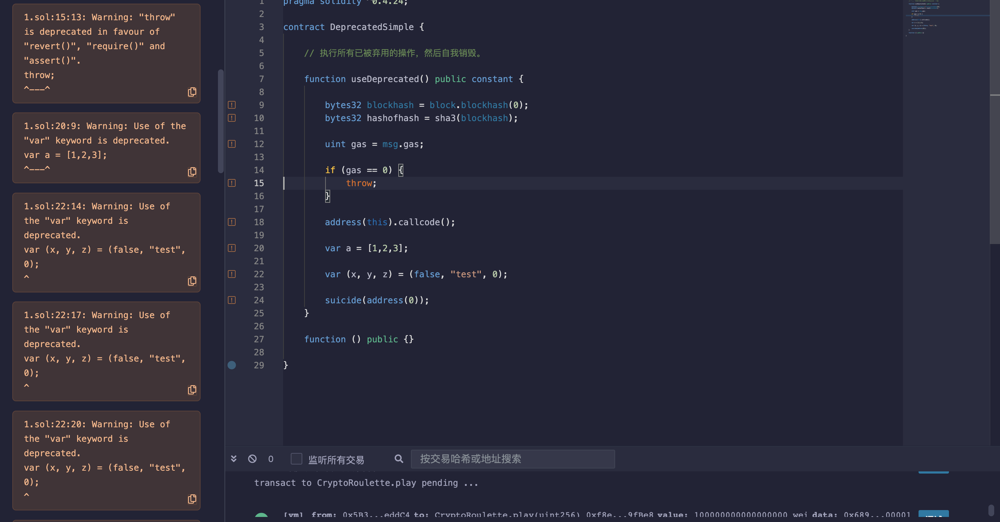

## 标题
使用已弃用的Solidity函数

## 关系
CWE-477：使用过时的函数

## 描述
Solidity中的几个函数和运算符已被弃用。使用它们会降低代码质量。在Solidity编译器的新主要版本中，废弃的函数和运算符可能导致副作用和编译错误。

## 修复措施
Solidity提供了替代废弃结构的方法。其中大部分是别名，因此替换旧结构不会破坏当前行为。例如，sha3可以替换为keccak256。

|废弃的|替代的|
|---|---|
|suicide(address)|selfdestruct(address)|
|block.blockhash(uint)|blockhash(uint)|
|sha3(...)|keccak256(...)|
|callcode(...)|delegatecall(...)|
|throw|revert()|
|msg.gas|gasleft|
|constant|view|
|var|对应的类型名称|

## 参考资料
* [全局变量和函数列表，截至Solidity 0.4.25](https://solidity.readthedocs.io/en/v0.4.25/miscellaneous.html#global-variables)
* [错误处理：Assert、Require、Revert和异常](https://solidity.readthedocs.io/en/v0.4.25/control-structures.html#error-handling-assert-require-revert-and-exceptions)
* [View函数](https://solidity.readthedocs.io/en/v0.4.25/contracts.html#view-functions)
* [从Solidity 0.4.20开始，不推荐使用未编写类型的声明](https://github.com/ethereum/solidity/releases/tag/v0.4.20)
* [Solidity编译器变更日志](https://github.com/ethereum/solidity/releases)

## 示例

### deprecated_simple.sol
``` solidity
pragma solidity ^0.4.24;

contract DeprecatedSimple {

    // 执行所有已被弃用的操作，然后自我销毁。

    function useDeprecated() public constant {

        bytes32 blockhash = block.blockhash(0);
        bytes32 hashofhash = sha3(blockhash);

        uint gas = msg.gas;

        if (gas == 0) {
            throw;
        }

        address(this).callcode();

        var a = [1,2,3];

        var (x, y, z) = (false, "test", 0);

        suicide(address(0));
    }

    function () public {}

}
```

### deprecated_simple_fixed.sol
``` solidity
pragma solidity ^0.4.24;

contract DeprecatedSimpleFixed {

    function useDeprecatedFixed() public view {

        bytes32 bhash = blockhash(0);
        bytes32 hashofhash = keccak256(bhash);

        uint gas = gasleft();

        if (gas == 0) {
            revert();
        }

        address(this).delegatecall();

        uint8[3] memory a = [1,2,3];

        (bool x, string memory y, uint8 z) = (false, "test", 0);

        selfdestruct(address(0));
    }

    function () external {}

}
```

## 验证
使用过时函数会显示已弃用警告
