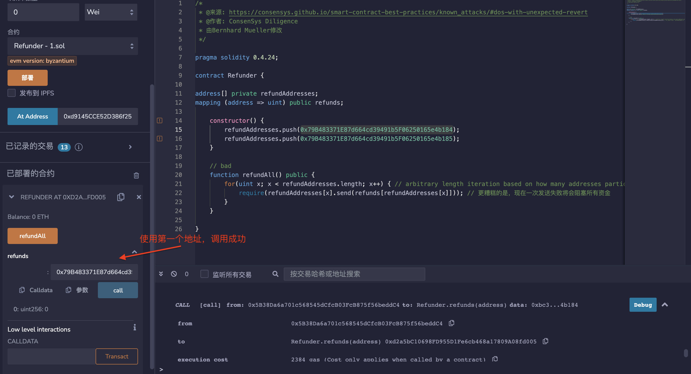
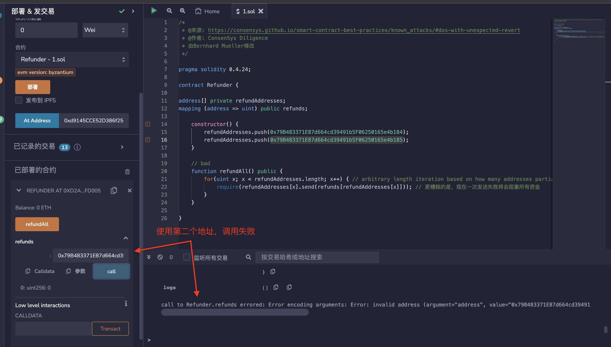

## 标题
失败调用导致的DoS攻击

## 关系
[CWE-703：异常条件的不正确检查或处理不当](https://cwe.mitre.org/data/definitions/703.html)

## 描述
外部调用可能会意外或故意失败，这可能会导致合约中的DoS情况。为了最大限度地减少这种故障造成的损害，最好将每个外部调用隔离到自己的事务中，可以由调用的接收者发起。这对于支付尤其重要，最好让用户提取资金，而不是自动向他们推送资金（这也降低了与gas限制相关的问题的几率）。

## 修复措施
建议遵循最佳调用实践：

* 避免在单个交易中组合多个调用，尤其是当调用作为循环的一部分执行时
* 始终假设外部调用可能会失败
* 实施合约逻辑以处理失败的调用

## 参考资料
* [以太坊智能合约最佳实践-对于外部调用，优先考虑拉取而不是推送](https://consensys.github.io/smart-contract-best-practices/development-recommendations/general/external-calls/#favor-pull-over-push-for-external-calls)

## 示例

### send_loop.sol
``` solidity
/*
 * @来源: https://consensys.github.io/smart-contract-best-practices/known_attacks/#dos-with-unexpected-revert
 * @作者: ConsenSys Diligence
 * 由Bernhard Mueller修改
 */

pragma solidity 0.4.24;

contract Refunder {

address[] private refundAddresses;
mapping (address => uint) public refunds;

    constructor() {
        refundAddresses.push(0x79B483371E87d664cd39491b5F06250165e4b184);
        refundAddresses.push(0x79B483371E87d664cd39491b5F06250165e4b185);
    }

    // bad
    function refundAll() public {
        for(uint x; x < refundAddresses.length; x++) { // arbitrary length iteration based on how many addresses participated
            require(refundAddresses[x].send(refunds[refundAddresses[x]])); // 更糟糕的是，现在一次发送失败将会阻塞所有资金
        }
    }

}
```

## 验证
send_loop.sol合约中的refundAll函数存在问题，它在循环中执行多个外部调用，如果其中一个调用失败，整个循环都会失败，导致DoS攻击。修复的方法是将每个外部调用隔离到自己的事务中，可以由调用的接收者发起。

