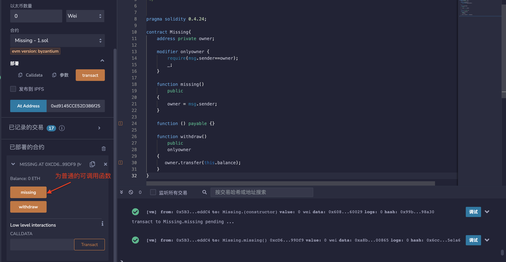
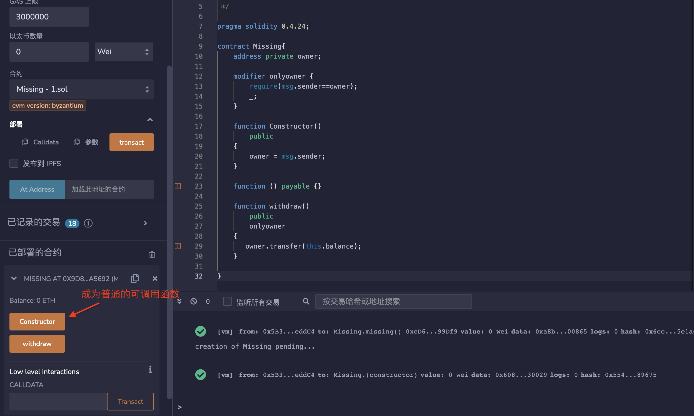

## 标题
错误的构造函数名称

## 关系
[CWE-665：不正确的初始化](http://cwe.mitre.org/data/definitions/665.html)

## 描述
构造函数是仅在合约创建期间调用一次的特殊函数。它们通常执行关键的、特权的操作，例如设置合约的所有者。在Solidity版本0.4.22之前，定义构造函数的唯一方法是创建一个与包含它的合约类相同名称的函数。如果函数的名称与合约名称不完全匹配，那么原本应该成为构造函数的函数将成为一个普通的可调用函数。这种行为有时会导致安全问题，特别是当智能合约代码被重新使用但构造函数的名称没有相应地更改时。

## 修复措施
Solidity版本0.4.22引入了一个新的构造函数关键字，使构造函数的定义更清晰。因此，建议将合约升级到Solidity编译器的最新版本，并改用新的构造函数声明。

## 参考资料
* [SigmaPrime - 构造函数的注意事项](https://blog.sigmaprime.io/solidity-security.html#constructors)
## 示例
### incorrect_constructor_name1.sol
```solidity
/*
 * @来源: https://github.com/trailofbits/not-so-smart-contracts/blob/master/wrong_constructor_name/incorrect_constructor.sol
 * @作者: Ben Perez
 * 由Gerhard Wagner修改
 */


pragma solidity 0.4.24;

contract Missing{
    address private owner;

    modifier onlyowner {
        require(msg.sender==owner);
        _;
    }

    function missing()
        public 
    {
        owner = msg.sender;
    }

    function () payable {} 

    function withdraw() 
        public 
        onlyowner
    {
       owner.transfer(this.balance);
    }
}
```

### incorrect_constructor_name1_fixed.sol
```solidity
/*
 * @来源: https://github.com/trailofbits/not-so-smart-contracts/blob/master/wrong_constructor_name/incorrect_constructor.sol
 * @作者: Ben Perez
 * 由Gerhard Wagner修改
 */


pragma solidity ^0.4.24;

contract Missing{
    address private owner;

    modifier onlyowner {
        require(msg.sender==owner);
        _;
    }

    constructor()
        public
    {
        owner = msg.sender;
    }

    function () payable {}

    function withdraw()
        public
        onlyowner
    {
       owner.transfer(this.balance);
    }
}
```

### incorrect_constructor_name2.sol
```solidity
/*
 * @来源: https://github.com/trailofbits/not-so-smart-contracts/blob/master/wrong_constructor_name/incorrect_constructor.sol
 * @作者: Ben Perez
 * 由Gerhard Wagner修改
 */

pragma solidity 0.4.24;

contract Missing{
    address private owner;

    modifier onlyowner {
        require(msg.sender==owner);
        _;
    }

    function Constructor()
        public 
    {
        owner = msg.sender;
    }

    function () payable {} 

    function withdraw() 
        public 
        onlyowner
    {
       owner.transfer(this.balance);
    }

}
```

### incorrect_constructor_name2_fixed.sol
```solidity
/*
 * @来源: https://github.com/trailofbits/not-so-smart-contracts/blob/master/wrong_constructor_name/incorrect_constructor.sol
 * @作者: Ben Perez
 * 由Gerhard Wagner修改
 */

pragma solidity ^0.4.24;

contract Missing{
    address private owner;

    modifier onlyowner {
        require(msg.sender==owner);
        _;
    }

    constructor()
        public
    {
        owner = msg.sender;
    }

    function () payable {}

    function withdraw()
        public
        onlyowner
    {
       owner.transfer(this.balance);
    }

}
```

## 验证
部署incorrect_constructor_name1.sol以及incorrect_constructor_name2.sol之中的合约，显示皆为普通的可调用函数。


