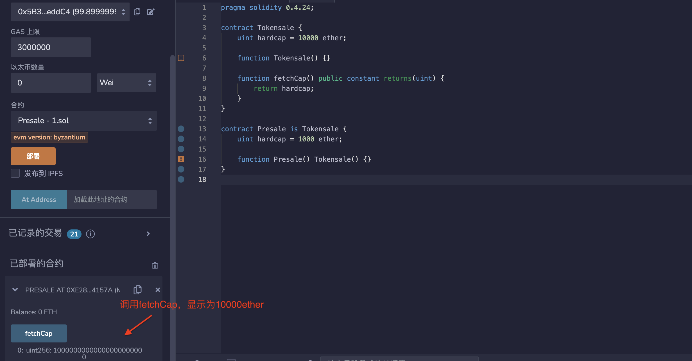
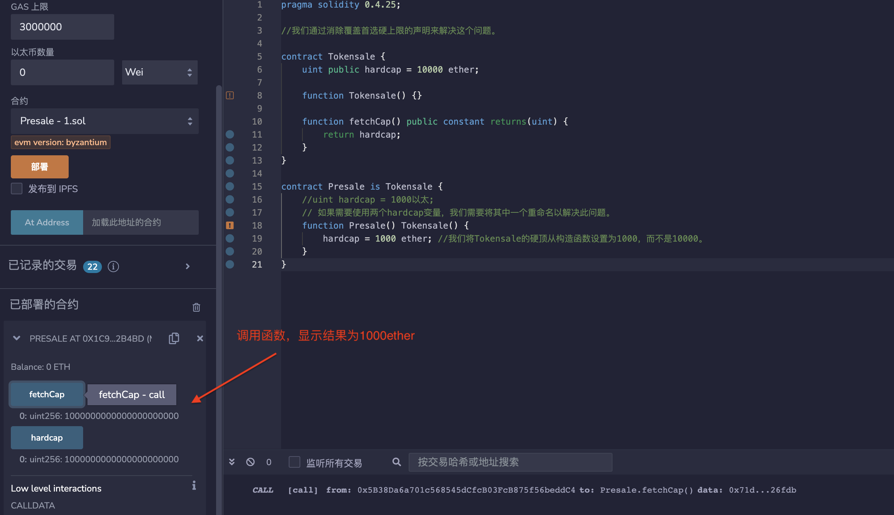

## 标题
状态变量的隐藏

## 关系
[CWE-710：不正确遵守编码规范](http://cwe.mitre.org/data/definitions/710.html)

## 描述
在使用继承时，Solidity允许对状态变量进行模糊命名。一个拥有变量x的合约A可以继承一个也定义了状态变量x的合约B。这将导致x有两个不同的版本，一个被合约A访问，另一个被合约B访问。在更复杂的合约系统中，这种情况可能被忽视，随后导致安全问题。

当合约和函数级别存在多个定义时，状态变量的隐藏也可能发生在单个合约内。

## 修复措施
仔细检查合约系统的存储变量布局，并消除任何模糊性。始终检查编译器警告，因为它们可以标记出单个合约中的问题。

## 参考资料
* [Solidity的Github上的问题-继承的状态变量的隐藏应该是一个错误（override关键字）](https://github.com/ethereum/solidity/issues/2563)
* [Solidity的Github上的问题-警告有关状态变量的隐藏](https://github.com/ethereum/solidity/issues/973)

## 示例

### ShadowingInFunctions.sol
```solidity
pragma solidity 0.4.24;

contract ShadowingInFunctions {
    uint n = 2;
    uint x = 3;

    function test1() constant returns (uint n) {
        return n; // 将返回 0
    }

    function test2() constant returns (uint n) {
        n = 1;
        return n; // 将返回 1
    }

    function test3() constant returns (uint x) {
        uint n = 4;
        return n+x; // 将返回 4
    }
}
```

### TokenSale.sol
```solidity
pragma solidity 0.4.24;

contract Tokensale {
    uint hardcap = 10000 ether;

    function Tokensale() {}

    function fetchCap() public constant returns(uint) {
        return hardcap;
    }
}

contract Presale is Tokensale {
    uint hardcap = 1000 ether;

    function Presale() Tokensale() {}
}

```

### TokenSale_fixed.sol
```solidity
pragma solidity 0.4.25;

//我们通过消除覆盖首选硬上限的声明来解决这个问题。

contract Tokensale {
    uint public hardcap = 10000 ether;

    function Tokensale() {}

    function fetchCap() public constant returns(uint) {
        return hardcap;
    }
}

contract Presale is Tokensale {
    //uint hardcap = 1000以太;
    // 如果需要使用两个hardcap变量，我们需要将其中一个重命名以解决此问题。
    function Presale() Tokensale() {
        hardcap = 1000 ether; //我们将Tokensale的硬顶从构造函数设置为1000，而不是10000。
    }
}
```

## 验证
*  部署TokenSale.sol中合约，结果显示为10000ether。

*  部署TokenSale_fixed.sol中合约，结果显示为1000ether。

