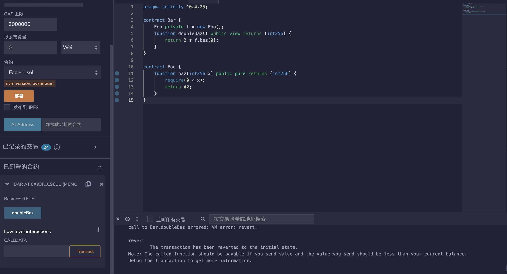
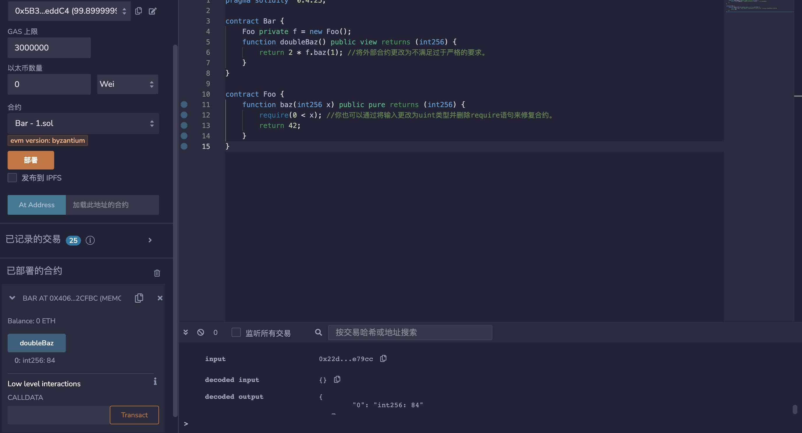

## 标题
要求违规

## 关系
[CWE-573: 调用方未正确遵循规范](https://cwe.mitre.org/data/definitions/573.html)

## 描述
Solidity require() 结构用于验证函数的外部输入。在大多数情况下，这些外部输入由调用方提供，但它们也可能由被调用方返回。在前一种情况下，我们称其为前置条件违规。违反要求可能表示以下两个可能的问题：

1. 合约中存在错误，提供了外部输入。
2. 用于表达要求的条件太强。

## 纠正措施
如果所需的逻辑条件太强，则应该将其弱化，以允许所有有效的外部输入。

否则，错误必须存在于提供外部输入的合约中，应该考虑通过确保不提供无效输入来修复其代码。

## 参考资料
[在Solidity中使用revert()、assert()和require()，以及EVM中的新REVERT操作码](https://media.consensys.net/when-to-use-revert-assert-and-require-in-solidity-61fb2c0e5a57)
## 示例
### requirement_simple.sol
```solidity

pragma solidity ^0.4.25;

contract Bar {
    Foo private f = new Foo();
    function doubleBaz() public view returns (int256) {
        return 2 * f.baz(0);
    }
}

contract Foo {
    function baz(int256 x) public pure returns (int256) {
        require(0 < x);
        return 42;
    }
}
```
### requirement_simple_fixed.sol
```solidity

pragma solidity ^0.4.25;

contract Bar {
    Foo private f = new Foo();
    function doubleBaz() public view returns (int256) {
        return 2 * f.baz(1); //将外部合约更改为不满足过于严格的要求。
    }
}

contract Foo {
    function baz(int256 x) public pure returns (int256) {
        require(0 < x); //你也可以通过将输入更改为uint类型并删除require语句来修复合约。
        return 42;
    }
}
```
## 验证
* 部署requirement_simple.sol中合约，在Bar合约的doubleBaz()函数中，传递了一个值为0的参数给f.baz()函数，这违反了Foo合约中的require()条件。因此，当调用doubleBaz()函数时，会抛出一个异常，导致函数无法返回正确的结果。

* 部署requirement_simple_fixed.sol中合约，修复后的代码将传递一个值为1的参数给f.baz()函数，满足了Foo合约中require()条件的要求。这样，当我们调用doubleBaz()函数时，不会再抛出异常，函数将返回正确的结果84.


