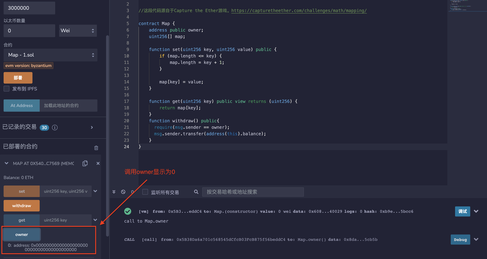
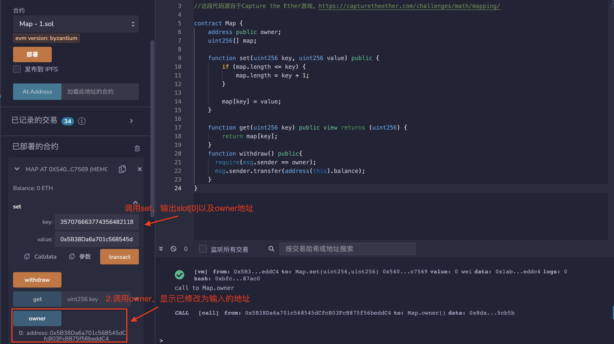

##  标题
写入任意存储位置

## 关系
[CWE-123：写入何处条件漏洞](https://cwe.mitre.org/data/definitions/123.html)

## 描述
智能合约的数据（例如，存储合约所有者）在EVM级别的某个存储位置（即键或地址）上持久存储。合约负责确保只有授权的用户或合约账户可以写入敏感存储位置。如果攻击者能够写入合约的任意存储位置，授权检查可能很容易被绕过。这可以允许攻击者破坏存储；例如，通过覆盖存储合约所有者地址的字段。

## 修复措施
作为一般建议，考虑到所有数据结构共享相同的存储（地址）空间，应确保对一个数据结构的写入不会意外地覆盖另一个数据结构的条目。

## 参考资料
* [参加Underhanded Solidity编码比赛2017（荣誉提名）](https://github.com/Arachnid/uscc/tree/master/submissions-2017/doughoyte)
## 示例

### arbitrary_location_write_simple.sol
```solidity

pragma solidity ^0.4.25;

contract Wallet {
    uint[] private bonusCodes;
    address private owner;

    constructor() public {
        bonusCodes = new uint[](0);
        owner = msg.sender;
    }

    function () public payable {
    }

    function PushBonusCode(uint c) public {
        bonusCodes.push(c);
    }

    function PopBonusCode() public {
        require(0 <= bonusCodes.length);
        bonusCodes.length--;
    }

    function UpdateBonusCodeAt(uint idx, uint c) public {
        require(idx < bonusCodes.length);
        bonusCodes[idx] = c;
    }

    function Destroy() public {
        require(msg.sender == owner);
        selfdestruct(msg.sender);
    }
}
```

###  arbitrary_location_write_simple_fixed.sol
```solidity
pragma solidity ^0.4.25;

contract Wallet {
    uint[] private bonusCodes;
    address private owner;

    constructor() public {
        bonusCodes = new uint[](0);
        owner = msg.sender;
    }

    function () public payable {
    }

    function PushBonusCode(uint c) public {
        bonusCodes.push(c);
    }

    function PopBonusCode() public {
        require(0 < bonusCodes.length);
        bonusCodes.length--;
    }

    function UpdateBonusCodeAt(uint idx, uint c) public {
        require(idx < bonusCodes.length); //由于现在你必须推送很多代码，这不再是一次随意的写入。
        bonusCodes[idx] = c;
    }

    function Destroy() public {
        require(msg.sender == owner);
        selfdestruct(msg.sender);
    }
}
```
### mapping_write.sol
```solidity
pragma solidity ^0.4.24;

//这段代码源自于Capture the Ether游戏。https://capturetheether.com/challenges/math/mapping/

contract Map {
    address public owner;
    uint256[] map;

    function set(uint256 key, uint256 value) public {
        if (map.length <= key) {
            map.length = key + 1;
        }

        map[key] = value;
    }

    function get(uint256 key) public view returns (uint256) {
        return map[key];
    }
    function withdraw() public{
      require(msg.sender == owner);
      msg.sender.transfer(address(this).balance);
    }
}
```
## 验证
部署mapping_write.sol中合约，调用owner显示为0地址。

合约中slot[0]存储的是owner，slot[1]存储的是map动态数组。
动态数组的存储方式是：slot【1】存储数组的长度，数组的data存储在：keccak256(bytes(1))+x，x就是数组的下标。
但是solidty一共有2^256个插槽，也就是说动态数组的存储范围覆盖了整个插槽范围，也就是说可以找到数组data起始位置推出slot[0]的位置，然后修改slot[0]数据。

```solidity
data=keccak256(bytes32(1)) = 0xb10e2d527612073b26eecdfd717e6a320cf44b4afac2b0732d9fcbe2b7fa0cf6
slot[0] =2**256-1-uint256(out)+1 = 35707666377435648211887908874984608119992236509074197713628505308453184860938
```
调用set（）函数，输入slot[0]以及想修改的owner地址，然后调用owner，显示已修改。

