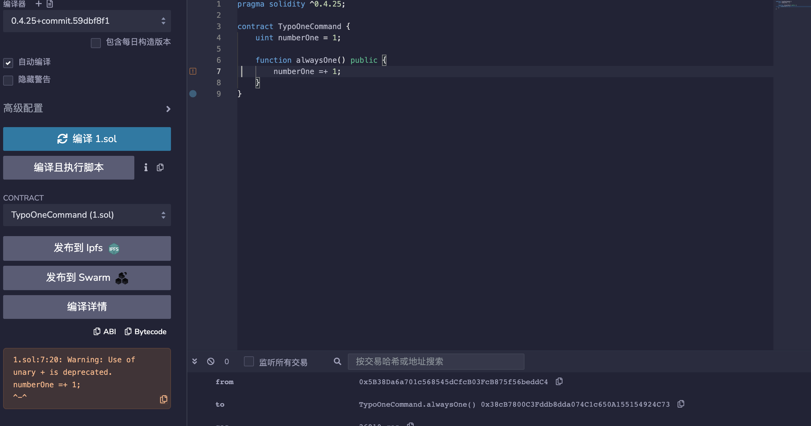

## 标题
笔误

## 关系
[CWE-480：使用错误的运算符](https://cwe.mitre.org/data/definitions/480.html)

## 描述
笔误可能发生在定义操作的意图是将一个数字与一个变量相加（+=），但错误地定义为（=+），引入了一个拼写错误，恰好是一个有效的运算符。它不是计算总和，而是重新初始化变量。

一元+运算符在新的solidity编译器版本中已被废弃。

## 修复措施
可以通过对任何数学运算进行前置条件检查或使用经过验证的算术计算库（如OpenZeppelin开发的SafeMath）来避免此弱点。

## 参考资料
* [HackerGold漏洞分析](https://blog.zeppelin.solutions/hackergold-bug-analysis-68d893cad738)
* [OpenZeppelin的SafeMath](https://github.com/OpenZeppelin/openzeppelin-solidity/blob/master/contracts/math/SafeMath.sol)
* [禁止一元加号](https://github.com/ethereum/solidity/issues/1760)

## 示例

### typo_one_command.sol

```solidity
pragma solidity ^0.4.25;

contract TypoOneCommand {
    uint numberOne = 1;

    function alwaysOne() public {
        numberOne =+ 1;
    }
}
```

### typo_safe_math.sol
```solidity
pragma solidity ^0.4.25;

/** 来源于OpenZeppelin的github
 * @标题 SafeMath
 * @使用安全检查的数学操作，在错误时进行回退。
 */
library SafeMath {

  /**
  * @可以将两个数字相乘，当结果溢出时会进行逆转。
  */
  function mul(uint256 a, uint256 b) internal pure returns (uint256) {
    // Gas优化：这比要求'a'不为零更便宜，但如果'b'也被测试，则会失去这个好处。
    // See: https://github.com/OpenZeppelin/openzeppelin-solidity/pull/522
    if (a == 0) {
      return 0;
    }

    uint256 c = a * b;
    require(c / a == b);

    return c;
  }

  /**
  * @整数相除，截断商，当被除数为零时返回。
  */
  function div(uint256 a, uint256 b) internal pure returns (uint256) {
    require(b > 0); // 在 Solidity 中，只有在除以 0 时才会自动进行断言。
    uint256 c = a / b;
    // assert(a == b * c + a % b); // 没有任何情况下这个不成立

    return c;
  }

  /**
  * @用于计算两个数的差。如果被减数大于减数，函数会返回一个错误值。
  */
  function sub(uint256 a, uint256 b) internal pure returns (uint256) {
    require(b <= a);
    uint256 c = a - b;

    return c;
  }

  /**
  * @将两个数字相加，在溢出时进行还原。
  */
  function add(uint256 a, uint256 b) internal pure returns (uint256) {
    uint256 c = a + b;
    require(c >= a);

    return c;
  }

  /**
  * @除两个数字并返回余数（无符号整数模运算），当除以零时返回错误。
  */
  function mod(uint256 a, uint256 b) internal pure returns (uint256) {
    require(b != 0);
    return a % b;
  }
}


contract TypoSafeMath {

    using SafeMath for uint256;
    uint256 public numberOne = 1;
    bool public win = false;

    function addOne() public {
        numberOne =+ 1;
    }

    function addOneCorrect() public {
        numberOne += 1;
    }

    function addOneSafeMath() public  {
        numberOne = numberOne.add(1);
    }

    function iWin() public {
        if(!win && numberOne>3) {
            win = true;
        }
    }
}
```

### typo_simple.sol
```solidity
typo_simple.sol
pragma solidity ^0.4.25;

contract TypoSimple {

    uint onlyOne = 1;
    bool win = false;

    function addOne() public {
        onlyOne =+ 1;
        if(onlyOne>1) {
            win = true;
        }
    }

    function iWin() view public returns (bool) {
        return win;
    }
}
```

## 验证
部署typo_one_command.sol会显示一元加号已弃用

